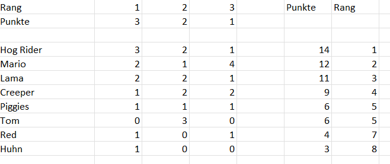
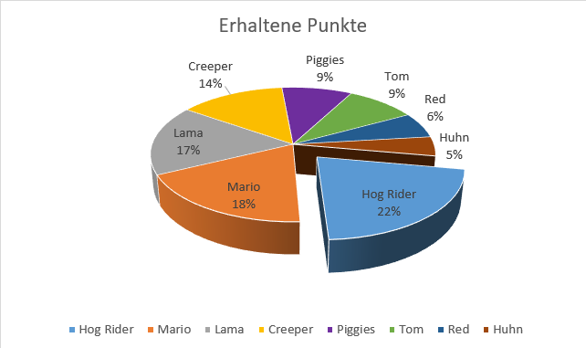
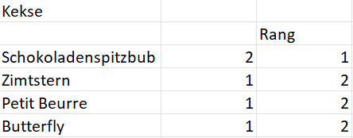
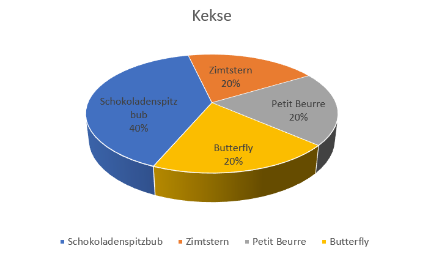

+++
title = "Auswertung Umfrage Plüschtierladen"
date = "1999-12-23"
draft = false
pinned = false
image = "kklickbaitt.png"
description = "Die Auswertung von der Umfrage für das Sortiment unseres Plüschtierladens ist da!"
+++
Im Blog "Sortiment für unseren Plüschtierladen bestimmen!" habe ich mit einem Kolleg eine Umfrage vorbereitet, welche die möglichen Charaktere für unsere Plüschtierladen bestimmen soll.

**Datenerhebung**

Insgesamt hatten wir acht Möglichkeiten gehabt uns die befragten Leute sollten in der Reihenfolge ihre drei liebsten Charaktere auswählen. Wir sind also im Schulhausumhergelaufen und haben ein Paar Schüler befragt. Wir fanden die Schule ein guter Ort, um die Umfrage durchzuführen, da die Leute in der Schule eher jünger sind und so die Videospielcharaktere auch eher kennen würden. Ausserdem kennt man viele Leute in der Schule und die Chance ist grösser, dass sie auf einen eingehen, anstatt zu ignorieren.

**Datenanalyse**

Nach der Umfrage haben wir die Daten in Excel gepackt und ausgewertet. Wie schon erwähnt haben die befragten drei Charaktere ausgewählt, ihre erste Auswahl hat also 3 Punkte bekommen, die zweite 2, die letzte einen und diese, die nicht ausgewählt wurden gar keinen. Nach der Umfrage kamen wir auf folgendes Ergebnis:

Der Hogrider bekannt von "Clash of Clans" und "Clash Royale" ist also der Gewinner mit 14 Punkten. Ihn dicht auf der Spur war die Jump and Run Legende Mario mit 12 Punkten. Und der dritte Platz wurde vom Lama aus Fortnite belegt mit 11 Punkten.

Mit 22% hat der Hogrider mehr als ein Fünftel der Punkte und war also sehr stark unterwegs. Mario und das Lama haben auch sehr stark abgeschnitten und haben gast gleicht viel Prozent. Mario mit 18% und das Lama nur ganz knapp dahinter mit 17%.

Bei jeder Bestellung von über 20 CHF haben werden wir auch ein paar gratis Kekse mitliefern, deshalb haben wir die Leute auch nach ihrer Lieblingskeksart gefragt. Dieses Mal gab es aber nur die Möglichkeit eine Keksart anzugeben. Leider konnten wir nicht so viele Stimmen sammeln, da viele sagten, dass sie sehr viele Keksarten sehr mögen, und keine Lieblingskeksart haben Folgendes kam raus:

Die Schokoladenspitzbuben wurden am meisten gewählt und werden also bei unseren Lieferungen mitgeliefert werden. In Prozent sieht es wie folgt aus:

Ich freue mich schon darauf Hogrider mit Schokoladenspitzbuben den Leuten zu versenden.