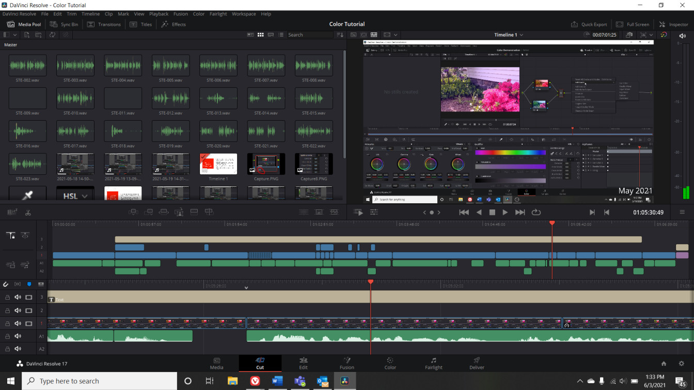

+++
title = "Werbevideo für Schulpräsentation"
date = "2022-12-13"
draft = false
pinned = false
image = "screenshot-2022-12-13-144608-1-.jpg"
description = "Ich habe für eine Schulpräsentation eine lustige Werbung für unser \"Unternehmen\" erstellt."
footnotes = ""
+++
Ich und ein Kolleg hatten den Auftrag eine Präsentation über unser "Plüschtierladen" zu erstellen. Dabei hatte ich die Idee eine Werbung für unser Laden zu machen. Die Werbung sollte möglichst unterhaltsam sein und Kinder dazu anregen bei uns Plüschtiere zu kaufen. Da unsere Plüschtiere vor allem Figuren aus Videospiele sind hatte ich die Idee eine schon fertige Videospielwerbung zu nehmen und unsere eigene Version daraus zu machen. Eine Werbung, die mich als Kind sehr überzeugt hat war die Werbung über die Einführung der neuen Truppe "Hog Rider" im Spiel  "Clash of Clans". Ich verwendete diese also als Grundlage und machte meine eigene Version daraus. 

Für das Schneiden des Videos habe ich DaVinci Resolve gebraucht. Das ist ein kostenloses Videobearbeitungsprogramm, welches sehr viele Möglichkeiten bietet und womit sogar schon Filme geschnitten wurden, und zwar keine unbekannten, sondern beispielsweise: Deadpool 2, Star Wars: Die letzten Jedi und Kingsman. 

Mit DaVinci Resolve hatte ich schon viele Videos für die Schule geschnitten und hatte deshalb schon Erfahrung damit. Allerdings stoss ich trotzdem ziemlich schnell auf ein Problem, nämlich wollte ich die "Hog Rider" von der Werbung mit unserem Plüschtieren ersetzen, aber die Bilder der Plüschtiere hatten alle entweder einen weissen oder einen schwarzen Hintergrund, das sah im Video nachher doof aus. Ich habe mir also ein Tutorialvideo angeschaut, wie man diese in DaVinci Resolve entfernt und es hat mich überrascht, dass man bei schwarzen Hintergründen anders vorgehen muss als mit weissen. Bei beiden muss man aber beim Effektteil von DaVinci Resolve den Effekt "Luma Keyer" geben. Bei weissen Hintergründen benutzt man danach die Einstellung "Saturation" und bei schwarzen "Luminance".

Ich wollte ausserdem, dass unsere Plüschtiere sich bewegen und so eine lebendige Wirkung haben und nicht nur dumm rumstanden. Dafür habe ich die Transform Option von "DaVinci Resolve" gebraucht. In dieser kann man die Position angeben, welche ein bestimmtes Bild in einer bestimmten Zeit vom Video haben soll. Danach musste ich nur die Position von den Plüschtieren jede paar Frames ändern und schon hatten sie eine lebendigere Wirkung. Natürlich hat das sehr lange gebraucht, aber es hat mir sehr Spass gemacht das Video zu schneiden und es hat sich, wie gar nicht zu lang angefühlt.

Hoffentlich werde ich in Zukunft noch viele weitere Videos schneiden müssen, denn wie schon erwähnt macht es mir unglaublic Spass.

Unser Werbevideo: <https://www.youtube.com/watch?v=q5LFSFCHVMU>

Original Werbung: <https://www.youtube.com/watch?v=XH3Xu1-cvII&t=0s>